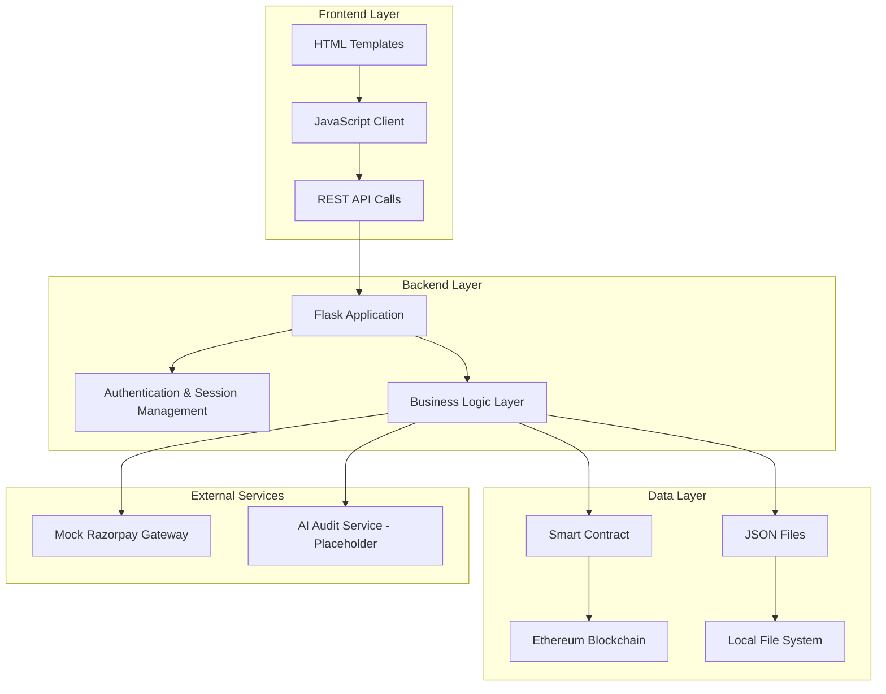

# Design Document

## Overview

The Green Hydrogen Credit Marketplace is a hybrid blockchain-web application that combines Flask web framework, Ethereum smart contracts (via Brownie), and traditional JSON data storage. The system enables a complete marketplace for hydrogen production credits with multi-stakeholder access, payment processing, and regulatory oversight.

The architecture follows a single-file Flask application approach with embedded HTML templates, blockchain integration through Brownie/Web3, and hybrid data storage using both smart contracts and JSON files for different data types.

## Architecture

### High-Level Architecture



### Technology Stack

- **Backend**: Flask (Python)
- **Blockchain**: Ethereum (via Brownie framework)
- **Smart Contracts**: Solidity with OpenZeppelin
- **Frontend**: HTML5, CSS3, JavaScript (embedded in Flask)
- **Data Storage**: Hybrid (Blockchain + JSON files)
- **Payment**: Mock Razorpay integration
- **Development**: Python virtual environment, Ganache for local blockchain

## Components and Interfaces

### 1. Smart Contract Layer

**GreenHydrogenCredit.sol** (Enhanced)
- Extends ERC20 token standard
- Implements role-based access control
- Manages credit issuance, transfers, and account freezing
- Tracks producer certification and quota management

```solidity
contract GreenHydrogenCredit is ERC20, Ownable {
    struct Producer {
        bool certified;
        uint256 totalIssued;
        uint256 lastIssuanceTime;
    }
    
    struct Factory {
        uint256 quota;
        bool hasQuota;
        uint256 creditsPurchased;
        bool quotaMet;
    }
    
    mapping(address => Producer) public producers;
    mapping(address => Factory) public factories;
    mapping(address => bool) public isFrozen;
    mapping(address => string) public userRoles;
    
    // Events for transparency
    event CreditIssued(address indexed producer, uint256 amount);
    event CreditPurchased(address indexed buyer, uint256 amount, uint256 price);
    event QuotaSet(address indexed factory, uint256 quota);
    event QuotaMet(address indexed factory);
    event AccountFrozen(address indexed account, bool status);
}
```

### 2. Flask Application Layer

**Core Application Structure**
- Single-file architecture with embedded templates
- Session-based authentication
- RESTful API endpoints
- Real-time data updates via JavaScript

**Key Modules:**
- Authentication & Authorization
- Blockchain Integration
- Payment Processing
- Data Management
- API Endpoints

### 3. User Interface Components

**Role-Based Dashboards:**
- Producer Dashboard: Credit issuance, wallet management
- Factory Dashboard: Credit purchasing, quota tracking
- Government Dashboard: Account management, monitoring, auditing
- State Pollution Body Dashboard: Compliance tracking, certificate issuance
- Citizen Dashboard: Simple credit purchasing

**Common UI Elements:**
- Login/Registration forms
- Real-time balance displays
- Transaction history tables
- Payment processing forms
- Notification systems

### 4. Data Management Layer

**Blockchain Data (Smart Contract):**
- Credit balances and transfers
- Account freeze status
- Producer certifications
- Factory quotas and compliance

**JSON File Data (Local Storage):**
- Transaction history (`transactions.json`)
- User session data
- Payment records
- Certificate records
- Audit logs

## Data Models

### 1. User Roles and Accounts

```python
# Account mapping structure
account_roles = {
    "producer": 0,      # Ethereum account index
    "factory": 1,
    "government": 2,
    "state_pollution_body": 3,
    "citizen": 4
}

# User session data
user_session = {
    "role": str,
    "address": str,
    "authenticated": bool,
    "login_time": datetime
}
```

### 2. Transaction Records

```python
# Transaction log structure (transactions.json)
transaction_record = {
    "timestamp": str,           # ISO format
    "type": str,               # ISSUE, PURCHASE, TRANSFER, FREEZE, etc.
    "from_address": str,
    "to_address": str,
    "amount_ghc": float,
    "amount_rupees": float,
    "tx_hash": str,
    "details": str,
    "status": str              # SUCCESS, FAILED, PENDING
}
```

### 3. Credit and Quota Management

```python
# Producer data
producer_data = {
    "address": str,
    "certified": bool,
    "total_issued": int,
    "last_issuance": datetime,
    "production_capacity": int
}

# Factory data
factory_data = {
    "address": str,
    "quota": int,              # Optional quota in GHC
    "credits_purchased": int,
    "quota_met": bool,
    "certificates": list       # Compliance certificates
}
```

### 4. Payment Processing

```python
# Payment record
payment_record = {
    "payment_id": str,
    "user_address": str,
    "amount_ghc": int,
    "amount_rupees": float,
    "gateway": str,            # "razorpay_mock"
    "status": str,             # SUCCESS, FAILED, PENDING
    "timestamp": datetime,
    "transaction_hash": str
}
```

## Error Handling

### 1. Blockchain Error Handling

**Smart Contract Errors:**
- Insufficient balance checks
- Role permission validation
- Account freeze status verification
- Gas limit and transaction failures

**Implementation Strategy:**
```python
try:
    tx = contract.function(params, {'from': account})
    tx.wait(1)  # Wait for confirmation
    return {"status": "success", "tx_hash": tx.txid}
except Exception as e:
    return {"status": "error", "message": str(e)}
```

### 2. Payment Processing Errors

**Mock Razorpay Integration:**
- Payment validation
- Amount verification
- User authentication checks
- Transaction rollback on failure

### 3. Data Consistency Errors

**Hybrid Storage Challenges:**
- Blockchain-JSON synchronization
- Transaction atomicity
- Data recovery mechanisms
- Backup and restore procedures

### 4. User Input Validation

**Frontend Validation:**
- Amount range checks
- Role permission verification
- Form data sanitization
- Session timeout handling

**Backend Validation:**
- API parameter validation
- Authentication verification
- Business logic constraints
- Rate limiting

## Testing Strategy

### 1. Smart Contract Testing

**Unit Tests:**
- Credit issuance functionality
- Transfer mechanisms
- Access control validation
- Account freeze/unfreeze operations

**Integration Tests:**
- Multi-user transaction scenarios
- Role-based permission testing
- Quota management workflows
- Government oversight functions

### 2. Flask Application Testing

**API Endpoint Tests:**
- Authentication flows
- CRUD operations
- Error handling scenarios
- Session management

**Frontend Tests:**
- User interface interactions
- Form validation
- Real-time data updates
- Cross-browser compatibility

### 3. End-to-End Testing

**User Journey Tests:**
- Complete registration and login flow
- Credit issuance and purchase workflows
- Government regulatory actions
- Certificate issuance processes

**Performance Tests:**
- Concurrent user handling
- Blockchain transaction throughput
- Data synchronization performance
- Memory and resource usage

### 4. Security Testing

**Authentication Security:**
- Session hijacking prevention
- Role escalation protection
- Input sanitization validation
- CSRF protection

**Blockchain Security:**
- Smart contract vulnerability assessment
- Private key management
- Transaction replay protection
- Access control verification

## Implementation Considerations

### 1. Development Environment Setup

**Required Tools:**
- Python 3.8+ with virtual environment
- Brownie framework for blockchain development
- Ganache for local Ethereum blockchain
- Node.js for additional tooling (optional)

**Project Structure:**
```
project/
├── app.py                 # Main Flask application
├── easy_run.py           # Setup and run script
├── contracts/            # Smart contract files
├── scripts/              # Deployment scripts
├── tests/                # Test files
├── data/                 # JSON data files
├── venv/                 # Virtual environment
└── brownie-config.yaml   # Brownie configuration
```

### 2. Deployment Strategy

**Local Development:**
- Ganache blockchain for testing
- Flask development server
- Mock payment gateway

**Production Considerations:**
- Testnet deployment (Sepolia/Goerli)
- Production WSGI server (Gunicorn)
- Real payment gateway integration
- Database migration from JSON to PostgreSQL/MongoDB

### 3. Scalability Considerations

**Current Limitations:**
- Single-file Flask application
- JSON file storage
- Local blockchain dependency

**Future Enhancements:**
- Microservices architecture
- Database integration
- Cloud deployment
- Load balancing
- Caching mechanisms

### 4. Security Measures

**Authentication:**
- Session-based authentication
- Role-based access control
- Input validation and sanitization
- HTTPS enforcement (production)

**Blockchain Security:**
- Multi-signature wallets for government accounts
- Time-locked transactions for large amounts
- Audit trails for all transactions
- Regular security assessments